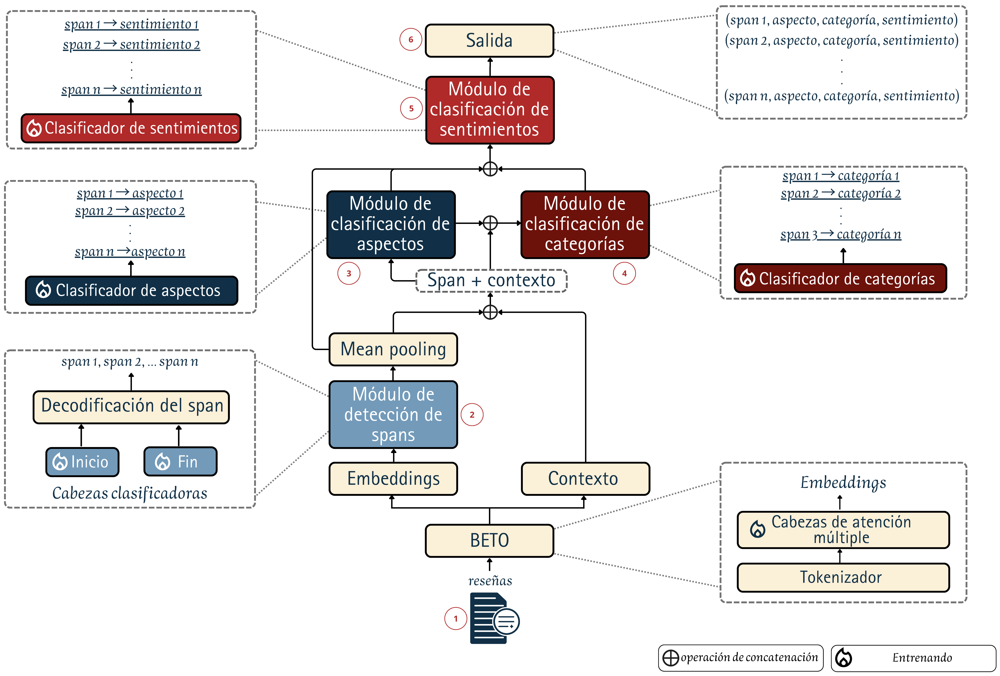
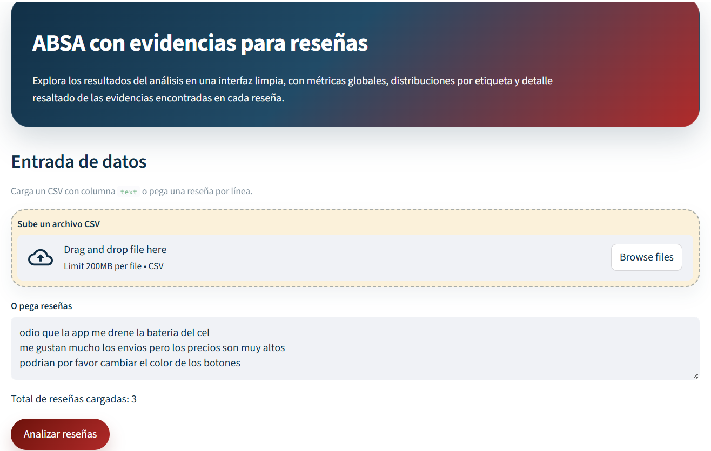
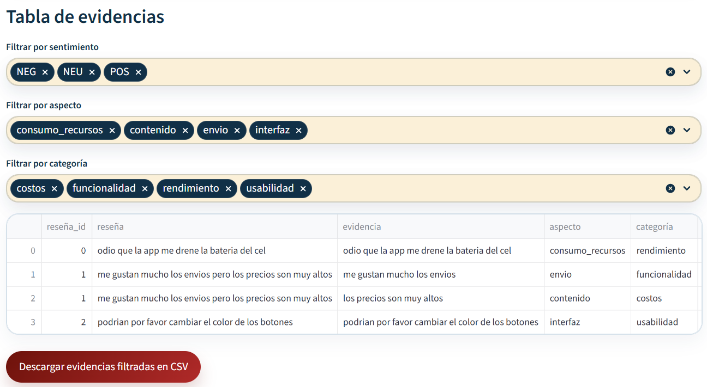
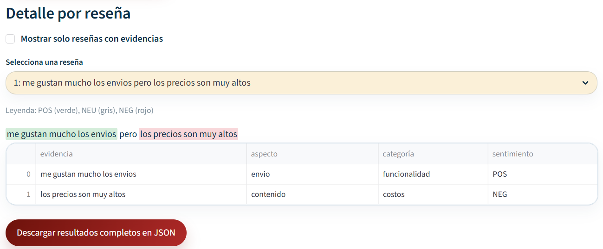

# ABSA for Colombian Spanish Reviews

**Aspect-Based Sentiment Analysis (ABSA)** for Spanish-language app reviews, focused on extracting **evidence spans, aspects, categories and sentiment** from real-world Colombian Spanish text.

> Research project + inference application developed as part of a Systems Engineering thesis.

## Why this project matters

Traditional sentiment analysis answers *whether* a review is positive or negative. This project goes further by identifying **what part of the review expresses the opinion**, **which aspect it refers to**, **the corresponding software-quality category**, and **the sentiment expressed by that evidence**.

Example:

```text
"me gustan mucho los envíos pero los precios son muy altos"

→ evidence: "me gustan mucho los envíos"
→ aspect: envío
→ category: funcionalidad
→ sentiment: POS

→ evidence: "los precios son muy altos"
→ aspect: contenido
→ category: costos
→ sentiment: NEG
```

## Model architecture

This project implements a **span-level ABSA architecture based on BETO**, rather than a conventional document-level sentiment classifier. The model first identifies the text spans that contain an opinion and then assigns structured labels to each detected span.

### End-to-end pipeline

```text
Review
  │
  ▼
BETO
  │
  ├──────────────► Context representation
  │
  ▼
Span detection
(Start / End)
  │
  ▼
Evidence spans
  │
  ├── Span + Context ──► Aspect classification
  │
  ├── Span + Context ──► Category classification
  │
  └── Span + Context ──► Sentiment classification
                              │
                              ▼
                   Structured ABSA output
```

### Technical design

The architecture is organized into the following stages:

1. **Spanish language representation — BETO**
   - The review is tokenized and processed by BETO (`dccuchile/bert-base-spanish-wwm-uncased`).
   - The transformer produces contextual token embeddings that capture the meaning of each token according to the surrounding text.

2. **Evidence span detection**
   - Dedicated classifier heads predict the **start and end positions** of opinion-bearing spans.
   - The predicted positions are decoded into one or more evidence spans inside the original review.

3. **Span representation + context**
   - The detected span is represented together with contextual information from the review.
   - Mean pooling is used to obtain a compact representation that can be consumed by the downstream classification modules.

4. **Aspect and category classification**
   - Each detected evidence span is classified into an **aspect**.
   - The same span/context representation is used to determine the corresponding **software-quality category**.

5. **Sentiment classification**
   - Each evidence span receives an independent sentiment prediction: **POS, NEU or NEG**.
   - This allows a single review to contain multiple opinions with different polarities.

6. **Structured output**
   - The final prediction is represented as a collection of structured records:

```text
(span, aspect, category, sentiment)
```

This design makes the model suitable for **fine-grained review analysis**, where a single review can contain multiple pieces of evidence associated with different aspects and sentiments.

### Architecture diagram

> **Core technical artifact:** the complete architecture of the model is shown below, including BETO, span detection, contextual representations and the aspect, category and sentiment classification heads.



## Features

- Span-level evidence extraction.
- Aspect and category prediction.
- Sentiment analysis over detected evidence.
- Training and evaluation pipeline.
- Optional K-Fold cross-validation.
- Batch inference over multiple reviews.
- Interactive **Streamlit** application for model inference and visualization.
- Model loading from **Hugging Face Hub**.
- Visual highlighting of detected evidence according to sentiment.
- Tabular exploration of predictions and distributions.
- CSV export of filtered evidence.
- JSON export of complete inference results.

## Tech stack

| Area | Technologies |
| --- | --- |
| Language | Python 3.10+ |
| NLP / Deep Learning | PyTorch, Transformers, Hugging Face |
| Language model | BETO (`dccuchile/bert-base-spanish-wwm-uncased`) |
| Data | Pandas, NumPy, Hugging Face Datasets |
| ML evaluation | Scikit-learn |
| Application | Streamlit |
| Model distribution | Hugging Face Hub |
| Training | GPU/CUDA supported |

## Streamlit application

The project also includes an interactive Streamlit interface that turns the research model into a usable inference application.

### Input and analysis

Users can upload a CSV containing reviews or paste reviews directly into the application before running inference.



### Evidence table

Detected evidence can be filtered by **sentiment, aspect and category**, then exported as CSV for further analysis.



### Review-level analysis

For each review, the application highlights the detected evidence and displays the associated aspect, category and sentiment.



## Repository structure

```text
.
├── absa_evidence_model.py   # Model, training and evaluation
├── absa_inference.py        # Checkpoint loading and inference
├── app.py                   # Streamlit application
├── evaluator.py             # Evaluation and reporting utilities
├── data/                    # Labeled datasets
├── docs/
│   └── images/              # Architecture and application screenshots
├── requirements.txt
└── README.md
```

## Getting started

### 1. Clone the repository

```bash
git clone https://github.com/MateoVera12/ABSA-model-for-processing-reviews-in-Spanish-from-Colombia.git
cd ABSA-model-for-processing-reviews-in-Spanish-from-Colombia
```

### 2. Create a virtual environment

```bash
python -m venv .venv
```

Windows PowerShell:

```powershell
.venv\Scripts\Activate.ps1
```

Linux/macOS:

```bash
source .venv/bin/activate
```

### 3. Install dependencies

```bash
pip install -r requirements.txt
```

For CUDA-enabled training, install the appropriate PyTorch build for your environment before installing the remaining dependencies if necessary.

## Training

Standard training/evaluation:

```bash
python absa_evidence_model.py --data "data/etiquetas/reseñas_etiquetadas_3493.json"
```

5-fold cross-validation:

```bash
python absa_evidence_model.py \
  --data "data/etiquetas/reseñas_etiquetadas_3493.json" \
  --cv_folds 5 \
  --cv_output_json "cv5_results.json"
```

To save a checkpoint for each fold:

```bash
python absa_evidence_model.py \
  --data "data/etiquetas/reseñas_etiquetadas_3493.json" \
  --cv_folds 5 \
  --save_fold_models
```

## Running the application

Start the Streamlit interface with:

```bash
streamlit run app.py
```

The application downloads the inference model from Hugging Face Hub when required, loads the checkpoint, and provides an interactive interface for analyzing reviews.

## Research context

The project was developed for research on **aspect-based sentiment analysis in Colombian Spanish app reviews**. The repository contains both the model-training pipeline and an application layer that demonstrates how the trained model can be used in a practical NLP workflow.

The combination of **NLP research, model training, evaluation and application development** makes this project representative of an end-to-end machine-learning workflow rather than a standalone notebook experiment.

## Authors

**Carlos Mateo Vera Grimaldo**  
Systems Engineer · Full-Stack / Software Development · NLP & AI

GitHub: [@MateoVera12](https://github.com/MateoVera12)

**Ana Gabriela Hernández Peña**  
Systems Engineer · M. Sc. student in Industrial Engineering · NLP & AI

GitHub: [@anga0527](https://github.com/anga0527)


